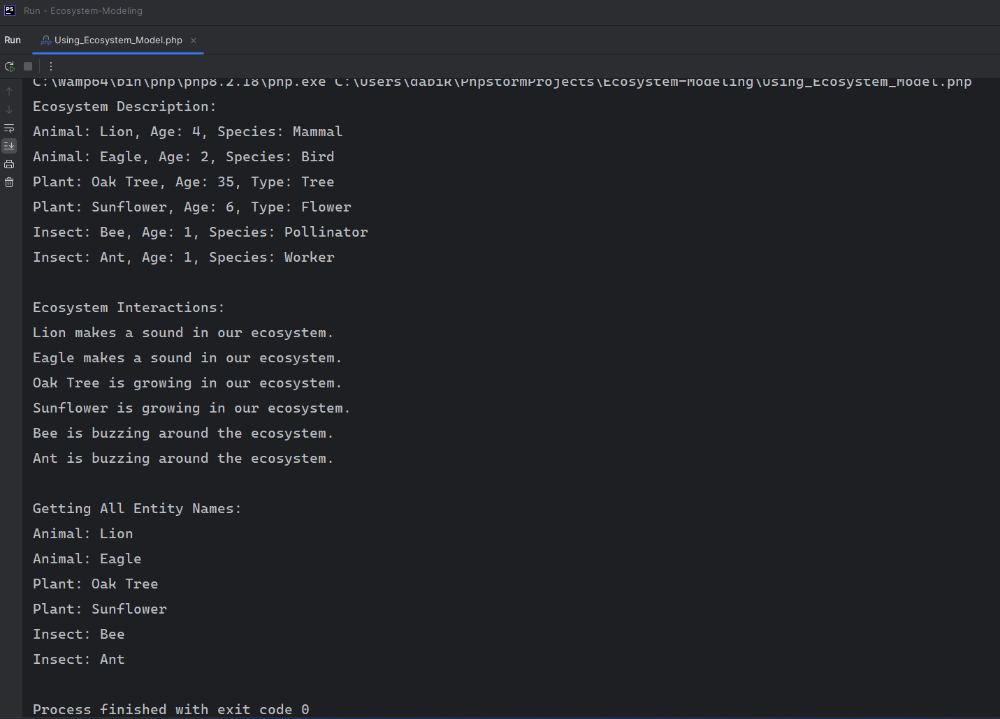

# Ecosystem-Modeling
Model a typical ecosystem of three entities: Animals, Plants, and Insects. 
Utilizing all relevant Object-Oriented Programming (OOP) concepts (Raw PHP).
# Technical code explanation
The following lines of code defines an ecosystem with animals, plants, 
and insects as entities. 
Each entity type is described by its properties, and interactions are 
specific to each type.
The Ecosystem class manages the collection of entities and can call their respective 
methods 
to describe and interact with them.
###### Steps to achieve this exercise
1. Define an abstract base class for common properties and methods 
(abstract class - entity.php).
2. Define derived classes for each entity type (Animals, Plants, and Insects).php.
3. Define an Ecosystem class that can interact with these entities (Ecosystem.php).
4. Using the Ecosystem class (Using_Ecosystem_Model.php)

###### Explanation of Each Step
This code defines an ecosystem with animals, plants, and insects. 
Each entity type is described by its properties, and interactions are specific 
to each type. The Ecosystem class manages the collection of entities and can 
call their respective methods to describe and interact with them.

##### Step One: Define the abstract base class
   1. We define an abstract class `Entity` with a protected property 
   `$name`, `$age` and a constructor to initialize it.
   2. The `getName` method returns the name of the entity.
   3. The `describe` method is abstract, forcing derived classes to implement it.
###### Entity.php Code
    <?php
    
    // Abstract base class defining a common interface and properties
    abstract class Entity {
        protected string $name;
        protected int $age;
    
        // Constructor to initialize the properties
        public function __construct($name, $age) {
            $this->name = $name;
            $this->age = $age;
        }
    
        // Method that return the names of an Entity
         public function getName(): string
         {
            return $this->name;
        }
    
        // Abstract method to be implemented by derived classes
        abstract public function describe();
    }

##### Step Two: Define the Animal, Plant, and Insect Classes
1. Each class extends `Entity` and has additional properties (`$species` or `$type`).
2. Each class implements the describe method to provide specific 
interaction/description behavior.
3. Each class also implements additional method specific to each entity class 
(`makesound` for Animals, `grow` for Plant, and `buzz` for Insect)
###### Animal.php Code
    <?php
    // Including the Entity class
    require_once('Entity.php');
    
    
    // Class representing an Animal, extending the Entity class
    class Animal extends Entity {
        private string $species;
    
        // Constructor to initialize the properties
        public function __construct($name, $age, $species) {
            parent::__construct($name, $age); // Calling the parent constructor
            $this->species = $species;
        }
    
        // Implementing the abstract method
        public function describe(): string
        {
            return "Animal: $this->name, Age: $this->age, Species: $this->species";
        }
    
        // Additional method specific to Animal
        public function makeSound(): string
        {
            return "$this->name makes a sound in our ecosystem.";
        }
    }

###### Plant.php Code
    <?php
    
    // Including the Entity class
    require_once('Entity.php');
    
    // Class representing a Plant, extending the Entity class
    class Plant extends Entity {
        private string $type;
    
        // Constructor to initialize the properties
        public function __construct($name, $age, $type) {
            parent::__construct($name, $age); // Calling the parent constructor
            $this->type = $type;
        }
    
        // Implementing the abstract method
        public function describe(): string
        {
            return "Plant: $this->name, Age: $this->age, Type: $this->type";
        }
    
        // Additional method specific to Plant
        public function grow(): string
        {
            return "$this->name is growing in our ecosystem.";
        }
    }

###### Insect.php Code
    <?php
    
    // Including the Entity class
    require_once('Entity.php');
    
    // Class representing an Insect, extending the Entity class
    class Insect extends Entity {
        private string $species;
    
        // Constructor to initialize the properties
        public function __construct($name, $age, $species) {
            parent::__construct($name, $age); // Calling the parent constructor
            $this->species = $species;
        }
    
        // Implementing the abstract method
        public function describe(): string
        {
            return "Insect: $this->name, Age: $this->age, Species: $this->species";
        }
    
        // Additional method specific to Insect
        public function buzz(): string
        {
            return "$this->name is buzzing around the ecosystem.";
        }
    }

##### Step Three: Define the Ecosystem Class
This class will manage the collection of entities and allow interaction with them.
1. Contains an array of `Entity` objects.
2. `addEntity` method adds entities to the ecosystem.
3. `describeEntities` method loops through the entities and calls their unique 
description method.
4. `interactEntities` method loops through the entities and calls their interact method.
5. `getEntityNames` method returns an array of entity names 
(loops through the entities to get all the names in the Ecosystem).

###### Ecosystem.php Code
    <?php
    
    // Class representing the Ecosystem
    class Ecosystem {
        private array $entities = [];
    
        // Method to add an entity to the ecosystem
        public function addEntity(Entity $entity): void
        {
            $this->entities[] = $entity;
        }
    
        // Method to describe all entities in the ecosystem
        public function describeEntities(): void
        {
            foreach ($this->entities as $entity) {
                echo $entity->describe() . PHP_EOL;
            }
        }
    
        // Method to interact with all entities in the ecosystem
        public function interactEntities(): void
        {
            foreach ($this->entities as $entity) {
                if ($entity instanceof Animal) {
                    echo $entity->makeSound() . PHP_EOL;
                } elseif ($entity instanceof Plant) {
                    echo $entity->grow() . PHP_EOL;
                } elseif ($entity instanceof Insect) {
                    echo $entity->buzz() . PHP_EOL;
                }
            }
        }
    
        // Method to get all entity names in the ecosystem
        public function getEntityNames(): void
        {
            foreach ($this->entities as $entity) {
                if ($entity instanceof Animal) {
                    echo "Animal: ". $entity->getName() . PHP_EOL;
                } elseif ($entity instanceof Plant) {
                   echo "Plant: ". $entity->getName() . PHP_EOL;
                } elseif ($entity instanceof Insect) {
                    echo "Insect: ". $entity->getName() . PHP_EOL;
                }
            }
        }
    }

##### Step Four: Using the Ecosystem Model
1. We create an `Ecosystem` instance.
2. We add instances of `Animal`, `Plant`, and `Insect` to the ecosystem.
3. We interact with the entities and echoing their names and sounds.
4. We describe the entities and echoing their `class (name, age, type)`.
5. We get all entity names in the Ecosystem.

###### Using_Ecosystem_Model.php Code
    <?php
    // Including the relevant class since separate files were used
    require_once('Ecosystem.php');
    require_once('Animal.php');
    require_once('Plant.php');
    require_once('Insect.php');
    
    // Creating the Ecosystem
    $ecosystem = new Ecosystem();
    
    // Adding Animals
    $ecosystem->addEntity(new Animal("Lion", 4,"Mammal"));
    $ecosystem->addEntity(new Animal("Eagle", 2,"Bird"));
    
    // Adding Plants
    $ecosystem->addEntity(new Plant("Oak Tree", 35,"Tree"));
    $ecosystem->addEntity(new Plant("Sunflower", 6,"Flower"));
    
    // Adding Insects
    $ecosystem->addEntity(new Insect("Bee", 1,"Pollinator"));
    $ecosystem->addEntity(new Insect("Ant", 1,"Worker"));
    
    // Get Ecosystem Description
    echo "Ecosystem Description:" . PHP_EOL;
    $ecosystem->describeEntities();
    
    // Get Ecosystem Interactions
    echo PHP_EOL . "Ecosystem Interactions:" . PHP_EOL;
    $ecosystem->interactEntities();
    
    // Get Ecosystem Entity Names
    echo PHP_EOL . "Getting All Entity Names:" . PHP_EOL;
    $ecosystem->getEntityNames();

##### Screenshot when we run the `Using_Ecosystem_Model.php` file

# Relating OOP Concepts to the Ecosystem-Model
Demonstrating the key OOP concepts such as classes, objects, inheritance, 
polymorphism, encapsulation, abstraction, and constructors to the 
Ecosystem-Modeling task. In the context of the provided PHP Ecosystem-Modeling task, 
the following OOP concepts are utilized:

###### 1. Classes and Objects
**Classes** are blueprints for creating objects. An **object** is an instance of a class. 
In the provided code, `Entity`, `Animal`, `Plant`, `Insect`, and `Ecosystem` are classes. 
Objects are created from these classes using the `new` keyword.

###### 2. Encapsulation
**Encapsulation** is the concept of bundling the data (properties) and the methods 
(functions) that operate on the data into a single unit, or class. 
It also involves restricting direct access to some of an object's components, 
which is a means of preventing accidental interference and misuse of the data.

##### In the Ecosystem Modeling Task:
1. Properties like `$name`, `$age`, and `$species` are encapsulated within their 
respective classes.
2. Access to these properties is controlled using public methods (*access modifiers*)
(`describe`, `makeSound`, `grow`, `buzz`).
Other access modifiers are `private` or `protected`.

###### 3. Inheritance
**Inheritance** allows a class to inherit properties and methods from another class. 
This promotes code reusability.
##### In the Ecosystem Modeling Task:
1. `Animal`, `Plant`, and `Insect` classes inherit from the `Entity` abstract class by 
using the `extends` keyword.
2. This means they inherit the constructor and can use common properties like 
`$name` and `$age`.

###### 4. Polymorphism
**Polymorphism** allows objects of different classes to be treated as objects of 
a common super class. This is often achieved through method overriding.
##### In the Ecosystem Modeling Task:
1. The `describe` method is defined in the Entity abstract class and overridden 
in the `Animal`, `Plant`, and `Insect` classes.
2. The `interactEntities` method in the Ecosystem class can interact with objects of type 
`Animal`, `Plant`, or `Insect` through polymorphism, calling their respective specific 
methods (`makeSound`, `grow`, `buzz`).

###### 5. Abstraction
**Abstraction** is the concept of hiding the complex implementation details and 
showing only the essential features of an object.
##### In the Ecosystem Modeling Task:
1. The `Entity` class is an abstract class, meaning it cannot be instantiated 
on its own and must be extended by other classes.
2. This ensures that only concrete implementations (like `Animal`, `Plant`, `Insect`) 
can be created, enforcing a certain structure.

###### 6. Constructor
**A constructor** is a special function in a class that gets called when an object 
is instantiated. It initializes the object's properties.
##### In the Ecosystem Modeling Task:
1. The `__construct` method in each class initializes the object's properties 
(`$name`, `$age`, and specific properties like `$species` or `$type`).